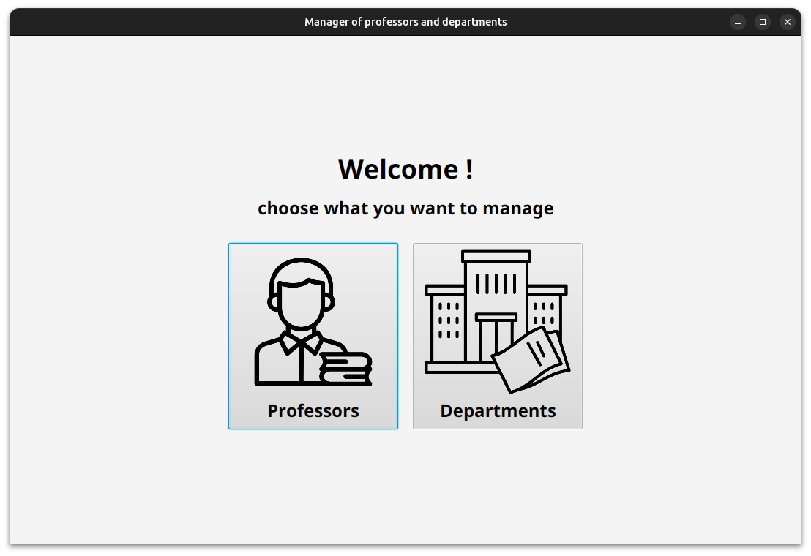
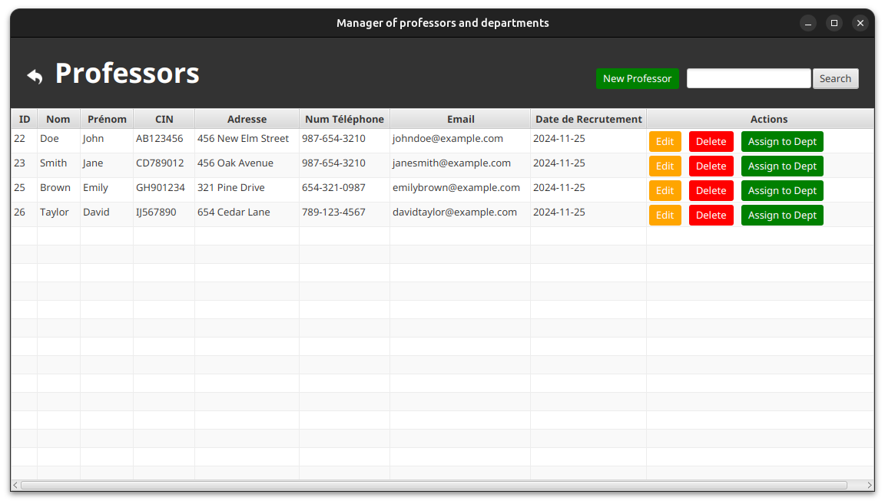
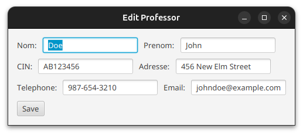
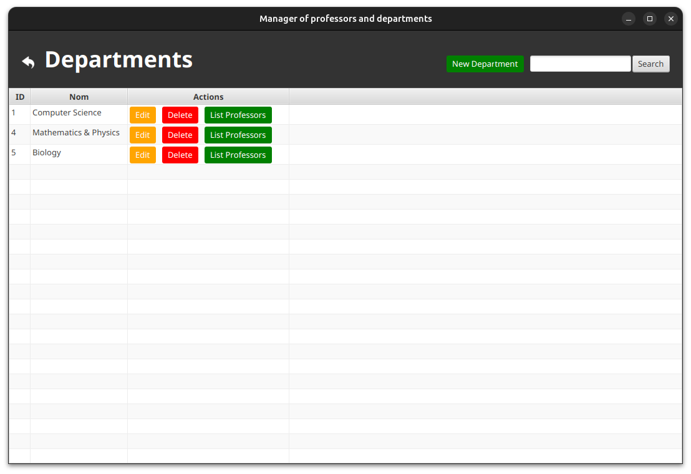

# Project Name

## Overview

This project is a Java application designed to manage Professors and Departments. The application follows an MVC (Model-View-Controller) architecture and uses JavaFX for the user interface. It interacts with a database to perform CRUD (Create, Read, Update, Delete) operations on Professor and Department entities.

## Project Structure

The project is organized into the following directories:

### 1. **`console/`**
- **Purpose**: A testing application where we directly call functions from the `metier` classes to test database interactions and data manipulations.
- **Key Files**:
    - Example: `Application.java`

### 2. **`database/`**
- **Purpose**: This directory contains classes responsible for database connection and handling SQL queries.
- **Key Files**:
    - Example: `SingletonConnexionDB.java`

### 3. **`models/`**
- **Purpose**: Contains the structure of the classes that define the entities we will be working with, such as `Professor` and `Department`.
- **Key Files**:
    - `Professor.java`
    - `Departement.java`

### 4. **`metier/`**
- **Purpose**: This directory sends requests to the database to fetch, update, and delete data. It encapsulates the business logic for handling entities like Professors and Departments.
- **Key Files**:
    - Example: `DeparmentMetier.java`
    - Example: `DeparmentMetierImpl.java`
    - Example: `ProfessorMetier.java`
    - Example: `ProfessorMetierImpl.java`

### 5. **`views/`**
- **Purpose**: Contains the JavaFX application code that provides a graphical user interface (GUI) for visualizing and interacting with the data.
- **Key Files**: Containing Reusable components `Components`, `dialogs` and `Pages` 
    - Example: `Components/Header.java`
    - Example: `dialogs/Delete.java`
    - Example: `Pages/DepartmentPage.java`
    - Example: `Pages/ProfessorPage.java`

### 6. **`controllers/`**
- **Purpose**: Acts as a bridge between the `metier`, `models`, and `views`. It handles the logic for connecting user inputs from the views to the business logic in the `metier` classes.
- **Key Files**:
    - Example: `ProfessorController.java`
    - Example: `DepartmentController.java`

## Database Schema
Professor Table:

    id: INT (Primary Key)
    nom: VARCHAR
    prenom: VARCHAR
    cin: VARCHAR
    adresse: TEXT
    telephone: VARCHAR
    email: VARCHAR
    dateRecruitment: DATE

Department Table:

    id: INT (Primary Key)
    nom: VARCHAR

## Scrennshots

 