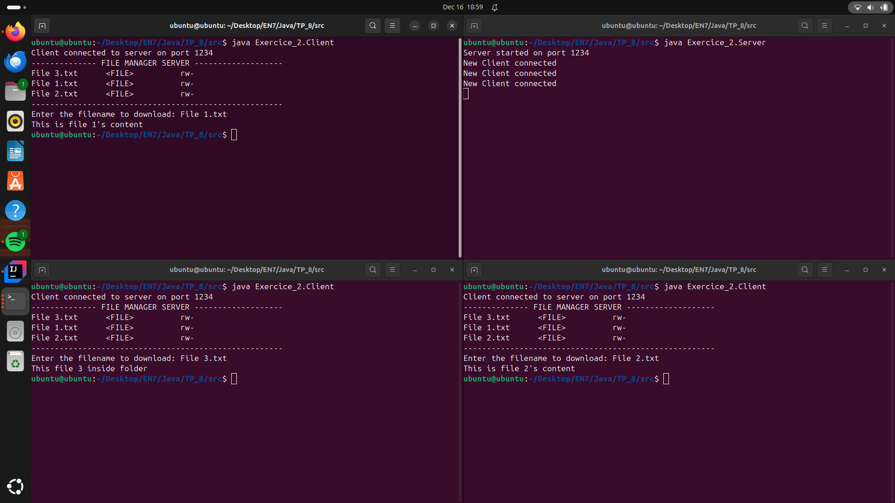

# File Manager Server

## Overview

This project consists of a file manager server implemented using Java sockets. The server allows clients to list files in a directory and download specific files. The server handles multiple client connections concurrently using threads.

## Server

### Class Definition

#### `Server` Class

The `Server` class listens for client connections and manages the file manager service. It accepts multiple client connections and starts a new `ClientHandler` thread for each connection.

### How It Works

1. **Initialization**:
    - The server starts and listens on port 1234.
    - It waits for clients to connect.

2. **Client Handling**:
    - For each client connection, a new `ClientHandler` thread is started.
    - The `ClientHandler` manages the interaction with the client, including listing files and handling file download requests.

### Example Usage

```bash
# Compilation 
ubuntu@ubuntu:~/Desktop/EN7/Java/TP_8/src/Exercice_2$ javac Server.java ClientHandler.java
# Start Server
ubuntu@ubuntu:~/Desktop/EN7/Java/TP_8/src$ java Exercice_2.Server
```

## Client

### Class Definition

#### `Client` Class

The `Client` class connects to the server and interacts with the file manager service. It sends requests to list files in a directory and download specific files.

### How It Works

1. **Initialization**:
    - The client connects to the server on port 1234.

2. **File Listing**:
    - The client sends a request to list files in a directory.
    - The server responds with a list of files in the directory.
    - The client displays the list of files.

### Example Usage

```bash
# Compilation
ubuntu@ubuntu:~/Desktop/EN7/Java/TP_8/src/Exercice_2$ javac Client.java
# Connect to Server
ubuntu@ubuntu:~/Desktop/EN7/Java/TP_8/src$ java Exercice_2.Client
```

## Example Output


## Directory Structure

```text
TP_8/
├── src/
│   └── Exercice_2/
│       ├── Client.java
│       ├── Server.java
│       ├── ClientHandler.java
│       └── mock_directory/
│           ├── File 1.txt
│           ├── File 2.txt
│           ├── File 3.txt
```